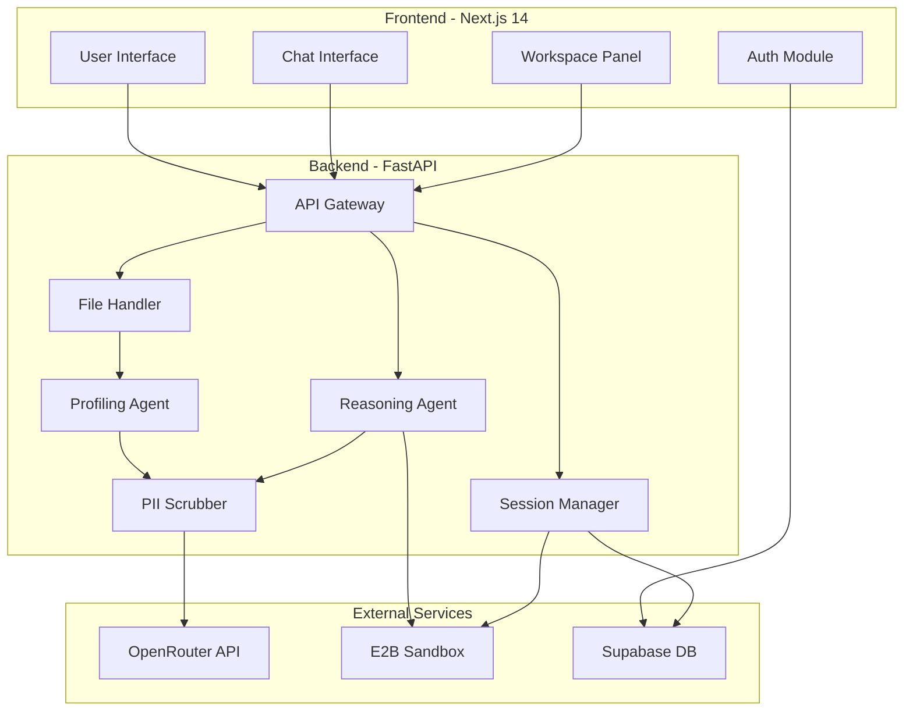
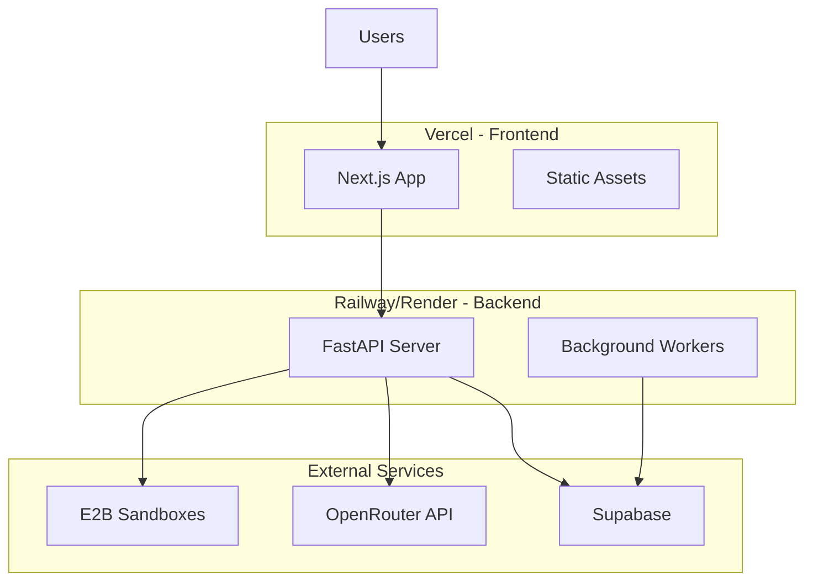

# Design Document: DataLens

## Overview

DataLens is a transparent data analysis platform that combines AI-powered code generation with secure sandbox execution. The system architecture follows a three-tier model: a Next.js frontend for user interaction, a FastAPI backend for orchestration, and E2B sandboxes for isolated code execution. The design prioritizes transparency by showing users the generated code and execution process, security through complete isolation of code execution, and intelligence through self-correcting AI agents.

### Key Design Principles

1. **Transparency First**: All generated code and execution logs are visible to users
2. **Security by Isolation**: No user code executes on the backend server
3. **Stateful Sessions**: Sandbox environments persist across queries for iterative analysis
4. **Privacy by Design**: PII is automatically redacted before sending to external AI services
5. **Fail-Safe Execution**: Agent self-correction with bounded retry attempts

## Architecture

### High-Level Architecture



### Component Interaction Flow

**File Upload Flow:**
1. User drags CSV/Excel file to frontend
2. Frontend sends file to `/api/upload` endpoint
3. FileHandler reads first 5 rows using pandas
4. ProfileAgent extracts schema metadata
5. PII Scrubber redacts sensitive data from schema
6. Schema sent to OpenRouter for analysis
7. Metadata returned to frontend and stored in session

**Query Processing Flow:**
1. User submits natural language query
2. Frontend sends query to `/api/query` endpoint
3. PII Scrubber redacts sensitive information
4. ReasoningAgent receives query + dataset schema
5. Agent generates execution plan via OpenRouter
6. Agent generates Python code
7. Code sent to E2B Sandbox for execution
8. Results returned and displayed in Workspace
9. If error occurs, agent analyzes and retries (max 3 times)

## Components and Interfaces

### Frontend Components

#### 1. Main Layout Component
- **Responsibility**: Manages split-screen layout
- **State**: 
  - `leftPanelWidth`: number (percentage)
  - `isAuthenticated`: boolean
- **Props**: None (root component)
- **Key Methods**:
  - `handleResize()`: Adjusts panel proportions
  - `handleAuth()`: Manages authentication state

#### 2. Chat Interface Component
- **Responsibility**: Displays conversation and handles user input
- **State**:
  - `messages`: Array<Message>
  - `inputValue`: string
  - `isLoading`: boolean
- **Props**:
  - `sessionId`: string
  - `onSendMessage`: (message: string) => Promise<void>
- **Key Methods**:
  - `sendMessage()`: Sends user query to backend
  - `renderMessage()`: Renders individual message with formatting

#### 3. Workspace Component
- **Responsibility**: Displays code, charts, and execution logs
- **State**:
  - `activeTab`: 'code' | 'charts' | 'logs'
  - `artifacts`: Array<Artifact>
  - `isTerminalExpanded`: boolean
- **Props**:
  - `executionData`: ExecutionResult
- **Key Methods**:
  - `renderCode()`: Syntax-highlighted code display
  - `renderChart()`: Interactive Plotly chart rendering
  - `toggleTerminal()`: Expand/collapse terminal logs

#### 4. File Upload Component
- **Responsibility**: Handles drag-and-drop file uploads
- **State**:
  - `isDragging`: boolean
  - `uploadProgress`: number
- **Props**:
  - `onFileUpload`: (file: File) => Promise<void>
- **Key Methods**:
  - `handleDrop()`: Processes dropped files
  - `validateFile()`: Checks file type and size

### Backend Components

#### 1. API Gateway (`main.py`)
- **Responsibility**: Routes requests and manages middleware
- **Endpoints**:
  - `POST /api/upload`: File upload handler
  - `POST /api/query`: Query processing
  - `GET /api/sessions`: List user sessions
  - `GET /api/sessions/{id}`: Retrieve session details
  - `POST /api/sessions/{id}/restore`: Restore previous session
- **Middleware**:
  - CORS configuration
  - Authentication validation
  - Request logging

#### 2. File Handler (`services/file_handler.py`)
- **Responsibility**: Processes uploaded files
- **Key Methods**:
  - `process_csv(file: UploadFile) -> DatasetSchema`
  - `process_excel(file: UploadFile) -> DatasetSchema`
  - `extract_metadata(df: DataFrame) -> dict`
- **Returns**: DatasetSchema with column info

#### 3. Profiling Agent (`agents/profiling_agent.py`)
- **Responsibility**: Analyzes dataset metadata
- **Dependencies**: OpenRouter API client
- **Key Methods**:
  - `analyze_schema(schema: dict) -> ProfileResult`
  - `infer_column_semantics(column: ColumnInfo) -> str`
- **Prompt Template**: "Analyze this dataset schema and provide insights about data types, potential issues, and suggested analyses"

#### 4. Reasoning Agent (`agents/reasoning_agent.py`)
- **Responsibility**: Plans queries and generates code
- **Framework**: smolagents
- **Key Methods**:
  - `generate_plan(query: str, schema: dict) -> ExecutionPlan`
  - `generate_code(plan: ExecutionPlan) -> str`
  - `execute_with_retry(code: str, max_retries: int = 3) -> ExecutionResult`
  - `analyze_error(error: str) -> ErrorAnalysis`
- **Tools**:
  - `run_python`: Executes code in E2B sandbox
  - `get_schema`: Retrieves dataset schema
- **System Prompt**: "You are a data science expert. Generate Python code using pandas and plotly to answer user queries. If code fails, analyze the error and fix it."

#### 5. PII Scrubber (`services/pii_scrubber.py`)
- **Responsibility**: Detects and redacts PII
- **Dependencies**: Microsoft Presidio (Analyzer + Anonymizer)
- **Key Methods**:
  - `scrub_text(text: str) -> tuple[str, list[Redaction]]`
  - `scrub_dataframe_sample(df: DataFrame) -> DataFrame`
- **Patterns Detected**:
  - Email addresses
  - Phone numbers
  - Credit card numbers (optional)
  - Social security numbers (optional)

#### 6. Session Manager (`services/session_manager.py`)
- **Responsibility**: Manages user sessions and sandbox lifecycle
- **Key Methods**:
  - `create_session(user_id: str) -> Session`
  - `get_sandbox(session_id: str) -> E2BSandbox`
  - `keep_alive(session_id: str) -> None`
  - `terminate_session(session_id: str) -> None`
  - `save_to_db(session: Session) -> None`
- **State Management**:
  - In-memory cache of active sessions
  - Background task for timeout cleanup
  - Automatic sandbox lifecycle management

#### 7. E2B Sandbox Client (`services/e2b_client.py`)
- **Responsibility**: Interfaces with E2B API
- **Key Methods**:
  - `create_sandbox(timeout: int = 300) -> Sandbox`
  - `execute_code(sandbox_id: str, code: str) -> ExecutionResult`
  - `install_packages(sandbox_id: str, packages: list[str]) -> None`
  - `upload_file(sandbox_id: str, file_data: bytes, filename: str) -> str`
- **Configuration**:
  - Keep-alive: 300 seconds
  - Pre-installed packages: pandas, plotly, numpy, scipy
  - Memory limit: 2GB
  - CPU limit: 2 cores

## Data Models

### Frontend Models (TypeScript)

```typescript
interface Message {
  id: string;
  role: 'user' | 'assistant' | 'system';
  content: string;
  timestamp: Date;
  artifacts?: Artifact[];
}

interface Artifact {
  type: 'code' | 'chart' | 'table' | 'error';
  content: string | PlotlyData;
  metadata?: Record<string, any>;
}

interface ExecutionResult {
  success: boolean;
  code: string;
  stdout: string;
  stderr: string;
  artifacts: Artifact[];
  executionTime: number;
}

interface Session {
  id: string;
  userId: string;
  createdAt: Date;
  lastActivity: Date;
  messages: Message[];
  datasetSchema?: DatasetSchema;
}

interface DatasetSchema {
  columns: ColumnInfo[];
  rowCount: number;
  sampleData: any[][];
}

interface ColumnInfo {
  name: string;
  dtype: string;
  nullCount: number;
  uniqueCount: number;
  sampleValues: any[];
}
```

### Backend Models (Python)

```python
from pydantic import BaseModel
from typing import Optional, List, Any
from datetime import datetime

class ColumnInfo(BaseModel):
    name: str
    dtype: str
    null_count: int
    unique_count: int
    sample_values: List[Any]
    min_value: Optional[Any] = None
    max_value: Optional[Any] = None

class DatasetSchema(BaseModel):
    columns: List[ColumnInfo]
    row_count: int
    sample_data: List[List[Any]]

class ExecutionPlan(BaseModel):
    steps: List[str]
    estimated_complexity: str
    required_libraries: List[str]

class ExecutionResult(BaseModel):
    success: bool
    code: str
    stdout: str
    stderr: str
    artifacts: List[dict]
    execution_time: float
    retry_count: int = 0

class Session(BaseModel):
    id: str
    user_id: str
    created_at: datetime
    last_activity: datetime
    sandbox_id: Optional[str] = None
    dataset_schema: Optional[DatasetSchema] = None
    message_count: int = 0

class Redaction(BaseModel):
    entity_type: str
    start: int
    end: int
    original_text: str
    replacement: str
```

### Database Schema (Supabase/Postgres)

```sql
-- Users table (managed by Supabase Auth)
-- sessions table
CREATE TABLE sessions (
    id UUID PRIMARY KEY DEFAULT gen_random_uuid(),
    user_id UUID NOT NULL REFERENCES auth.users(id),
    created_at TIMESTAMP WITH TIME ZONE DEFAULT NOW(),
    last_activity TIMESTAMP WITH TIME ZONE DEFAULT NOW(),
    dataset_schema JSONB,
    is_active BOOLEAN DEFAULT true
);

-- messages table
CREATE TABLE messages (
    id UUID PRIMARY KEY DEFAULT gen_random_uuid(),
    session_id UUID NOT NULL REFERENCES sessions(id) ON DELETE CASCADE,
    role VARCHAR(20) NOT NULL,
    content TEXT NOT NULL,
    artifacts JSONB,
    created_at TIMESTAMP WITH TIME ZONE DEFAULT NOW()
);

-- execution_logs table
CREATE TABLE execution_logs (
    id UUID PRIMARY KEY DEFAULT gen_random_uuid(),
    session_id UUID NOT NULL REFERENCES sessions(id) ON DELETE CASCADE,
    code TEXT NOT NULL,
    stdout TEXT,
    stderr TEXT,
    success BOOLEAN NOT NULL,
    execution_time FLOAT,
    retry_count INT DEFAULT 0,
    created_at TIMESTAMP WITH TIME ZONE DEFAULT NOW()
);

-- pii_redactions table (for audit)
CREATE TABLE pii_redactions (
    id UUID PRIMARY KEY DEFAULT gen_random_uuid(),
    session_id UUID NOT NULL REFERENCES sessions(id) ON DELETE CASCADE,
    entity_type VARCHAR(50) NOT NULL,
    redacted_at TIMESTAMP WITH TIME ZONE DEFAULT NOW()
);

-- Indexes
CREATE INDEX idx_sessions_user_id ON sessions(user_id);
CREATE INDEX idx_sessions_last_activity ON sessions(last_activity);
CREATE INDEX idx_messages_session_id ON messages(session_id);
CREATE INDEX idx_execution_logs_session_id ON execution_logs(session_id);
```


## Correctness Properties

*A property is a characteristic or behavior that should hold true across all valid executions of a system—essentially, a formal statement about what the system should do. Properties serve as the bridge between human-readable specifications and machine-verifiable correctness guarantees.*

### Property 1: Limited data profiling
*For any* dataset file uploaded, the profiling process should read and analyze only the first 5 rows, and the resulting schema should not contain the full dataset content.
**Validates: Requirements 1.3, 1.5**

### Property 2: Schema completeness
*For any* dataset processed, the generated schema should contain column names, data types, null counts, and sample values for all columns present in the dataset.
**Validates: Requirements 1.4**

### Property 3: Plan generation consistency
*For any* natural language query submitted, the Reasoning Agent should generate an execution plan with at least one step before generating code.
**Validates: Requirements 2.1**

### Property 4: Code library usage
*For any* code generated for data analysis, the code should import and use pandas for data manipulation and/or plotly for visualizations.
**Validates: Requirements 2.3**

### Property 5: Isolated execution
*For any* Python code generated, execution should occur exclusively in the E2B Sandbox with no local exec() or eval() calls on the backend server.
**Validates: Requirements 2.5, 7.1, 7.2**

### Property 6: Error analysis and correction
*For any* execution error returned from the sandbox, the Reasoning Agent should generate corrected code that differs from the original and addresses the specific error message.
**Validates: Requirements 3.1, 3.2**

### Property 7: Retry execution
*For any* corrected code generated after an error, the system should re-execute the code in the E2B Sandbox automatically.
**Validates: Requirements 3.3**

### Property 8: Code visibility
*For any* code generated by the Reasoning Agent, the complete code string should be displayed in the Workspace before and during execution.
**Validates: Requirements 2.4, 4.1**

### Property 9: Output capture
*For any* code execution in the E2B Sandbox, both stdout and stderr should be captured and displayed in the terminal log.
**Validates: Requirements 4.3**

### Property 10: Execution history
*For any* session with multiple code executions, all generated code and outputs should be stored and retrievable from the session history.
**Validates: Requirements 4.5**

### Property 11: Visualization rendering
*For any* Plotly figure generated in code execution, the system should render it as an interactive chart component in the Workspace.
**Validates: Requirements 5.1**

### Property 12: Multi-artifact organization
*For any* session with multiple visualizations, each should be displayed in a separate tab within the Workspace.
**Validates: Requirements 5.3**

### Property 13: Artifact code pairing
*For any* visualization displayed, the underlying code that generated it should be available in a separate Code tab.
**Validates: Requirements 5.5**

### Property 14: Stateful sandbox
*For any* follow-up query in an active session, variables and datasets from previous executions should remain accessible in the sandbox environment.
**Validates: Requirements 6.1, 6.3**

### Property 15: Fresh session isolation
*For any* new session created, a fresh E2B Sandbox instance should be provisioned with no state from previous sessions.
**Validates: Requirements 6.5**

### Property 16: Execution result structure
*For any* sandbox execution that completes, the response should contain only stdout, stderr, and artifact data without exposing internal sandbox details.
**Validates: Requirements 7.5**

### Property 17: PII redaction
*For any* text sent to the LLM (including queries, error messages, and data snippets), email addresses and phone numbers should be replaced with placeholder tokens before transmission.
**Validates: Requirements 8.1, 8.2, 8.3**

### Property 18: Redaction audit logging
*For any* PII redaction that occurs, an audit log entry should be created with the entity type and timestamp.
**Validates: Requirements 8.4**

### Property 19: Workspace data transparency
*For any* data displayed in the Workspace, the original unredacted values should be shown to the user while redacted versions are sent to the LLM.
**Validates: Requirements 8.5**

### Property 20: Session persistence
*For any* completed analysis session, the session data including messages, code, and artifacts should be saved to the database.
**Validates: Requirements 9.2**

### Property 21: Session restoration
*For any* previous session selected by a user, the restored session should contain all original chat messages and generated artifacts.
**Validates: Requirements 9.4**

### Property 22: Session data completeness
*For any* session stored in the database, it should include timestamps, user queries, generated code, and visualization metadata.
**Validates: Requirements 9.5**

### Property 23: Artifact tab labeling
*For any* artifacts generated in the Workspace, tabs should be labeled as "Code" and "Charts" according to artifact type.
**Validates: Requirements 10.3**

### Property 24: Unified API gateway
*For any* LLM request made by the system, it should be routed through the OpenRouter API endpoint.
**Validates: Requirements 11.1**

### Property 25: Rate limit handling
*For any* API call that encounters a rate limit error, the system should retry with exponential backoff delays.
**Validates: Requirements 11.4**

### Property 26: API key security
*For any* API error message displayed to users, it should not contain or expose the OpenRouter API key.
**Validates: Requirements 11.5**

### Property 27: Frontend-backend separation
*For any* data request from the frontend, communication should occur exclusively through REST API endpoints without direct database access.
**Validates: Requirements 12.1**

## Error Handling

### Error Categories

#### 1. File Upload Errors
- **Invalid file type**: Return 400 with message "Unsupported file type. Please upload CSV or Excel files."
- **File too large**: Return 413 with message "File size exceeds 100MB limit."
- **Corrupted file**: Return 422 with message "Unable to parse file. Please check file integrity."
- **Empty file**: Return 422 with message "File contains no data."

#### 2. Code Execution Errors
- **Syntax errors**: Agent analyzes and corrects, retries up to 3 times
- **Runtime errors**: Agent analyzes error message, identifies issue (e.g., wrong column name), generates fix
- **Timeout errors**: Return to user with message "Execution exceeded 60 second timeout. Consider simplifying the query."
- **Memory errors**: Return to user with message "Analysis requires too much memory. Try filtering the dataset first."

#### 3. Sandbox Errors
- **Sandbox creation failure**: Retry once, then return 503 with message "Unable to create execution environment. Please try again."
- **Sandbox connection lost**: Attempt reconnection once, then create new sandbox
- **Sandbox timeout**: Terminate sandbox, clear session state, notify user

#### 4. LLM API Errors
- **Rate limit (429)**: Exponential backoff: 1s, 2s, 4s, 8s, then fail
- **Invalid API key (401)**: Log error, return 500 with message "Service configuration error. Please contact support."
- **Model unavailable (503)**: Retry with backoff, then return user-friendly error
- **Token limit exceeded**: Truncate context intelligently, retry once

#### 5. Database Errors
- **Connection failure**: Retry 3 times with 1s delay, then return 503
- **Query timeout**: Log error, return 500 with message "Unable to save session. Please try again."
- **Constraint violation**: Log error, return 400 with specific validation message

#### 6. Authentication Errors
- **Invalid token**: Return 401 with message "Session expired. Please log in again."
- **Missing token**: Return 401 with message "Authentication required."
- **Insufficient permissions**: Return 403 with message "Access denied."

### Error Response Format

All API errors follow this structure:

```json
{
  "error": {
    "code": "ERROR_CODE",
    "message": "User-friendly error message",
    "details": {
      "field": "specific_field",
      "reason": "detailed_reason"
    },
    "timestamp": "2024-01-01T12:00:00Z",
    "request_id": "uuid"
  }
}
```

### Retry Strategy

```python
class RetryConfig:
    max_retries: int = 3
    base_delay: float = 1.0
    max_delay: float = 30.0
    exponential_base: float = 2.0
    
    def get_delay(self, attempt: int) -> float:
        delay = self.base_delay * (self.exponential_base ** attempt)
        return min(delay, self.max_delay)
```

## Testing Strategy

### Unit Testing

**Frontend (Jest + React Testing Library)**
- Component rendering tests
- User interaction tests (file upload, message sending)
- State management tests
- API integration mocks

**Backend (pytest)**
- API endpoint tests with test client
- Service layer tests with mocked dependencies
- Data model validation tests
- Database query tests with test database

**Key Unit Test Areas:**
- File handler: Test CSV/Excel parsing with various formats
- PII Scrubber: Test detection of emails, phone numbers with edge cases
- Session Manager: Test session lifecycle, timeout handling
- E2B Client: Test with mocked E2B API responses

### Property-Based Testing

**Framework**: Hypothesis (Python) for backend, fast-check (TypeScript) for frontend

**Configuration**: Each property test should run a minimum of 100 iterations to ensure comprehensive coverage.

**Test Tagging**: Each property-based test must include a comment with this format:
```python
# Feature: glassbox-analyst, Property {number}: {property_text}
```

**Property Test Implementation:**

1. **Property 1: Limited data profiling**
   - Generate random DataFrames with varying row counts (10-10000 rows)
   - Verify profiling reads exactly 5 rows
   - Verify schema doesn't contain full dataset

2. **Property 2: Schema completeness**
   - Generate random DataFrames with various column types
   - Verify schema includes all columns with correct metadata

3. **Property 5: Isolated execution**
   - Generate various Python code strings
   - Verify all execution goes through E2B client
   - Verify no local exec/eval calls

4. **Property 6: Error analysis and correction**
   - Generate code with known error patterns (KeyError, NameError, etc.)
   - Verify agent generates different corrected code
   - Verify correction addresses the specific error

5. **Property 10: Execution history**
   - Generate random sequences of code executions
   - Verify all are stored in session
   - Verify retrieval returns all executions in order

6. **Property 14: Stateful sandbox**
   - Generate random variable assignments
   - Execute follow-up code referencing those variables
   - Verify variables are accessible

7. **Property 17: PII redaction**
   - Generate random text with emails and phone numbers
   - Verify all PII is replaced with placeholders
   - Verify original structure is maintained

8. **Property 25: Rate limit handling**
   - Simulate rate limit responses
   - Verify exponential backoff delays
   - Verify eventual success or proper failure

### Integration Testing

**End-to-End Flows:**
1. Complete analysis flow: Upload → Query → Code Generation → Execution → Visualization
2. Error correction flow: Query → Failed Execution → Retry → Success
3. Session persistence flow: Analysis → Save → Logout → Login → Restore
4. Multi-query flow: Upload → Query 1 → Query 2 (using results from Query 1)

**Test Environment:**
- Staging E2B sandbox
- Test Supabase instance
- Mock OpenRouter API (for cost control)

### Performance Testing

**Metrics to Monitor:**
- File upload processing time (target: <2s for 10MB file)
- Code generation latency (target: <5s)
- Code execution time (target: <30s for typical queries)
- Session restoration time (target: <1s)

**Load Testing:**
- Concurrent users: Test with 10, 50, 100 simultaneous sessions
- Sandbox pool management: Verify proper cleanup and reuse
- Database connection pooling: Verify no connection leaks

### Security Testing

**Penetration Testing Scenarios:**
1. Attempt to execute malicious code that accesses backend filesystem
2. Attempt SQL injection through query parameters
3. Attempt to extract API keys through error messages
4. Attempt to access other users' sessions
5. Attempt XSS through chat messages

**PII Protection Testing:**
- Verify redaction with various PII formats
- Verify audit logs are created
- Verify original data shown to user but not sent to LLM

## Deployment Architecture

### Infrastructure Components



### Environment Variables

**Frontend (.env.local)**
```bash
NEXT_PUBLIC_API_URL=https://api.datalens.com
NEXT_PUBLIC_SUPABASE_URL=https://xxx.supabase.co
NEXT_PUBLIC_SUPABASE_ANON_KEY=xxx
```

**Backend (.env)**
```bash
# API Keys
OPENROUTER_API_KEY=sk-or-xxx
E2B_API_KEY=e2b_xxx
SUPABASE_URL=https://xxx.supabase.co
SUPABASE_SERVICE_KEY=xxx

# Configuration
ENVIRONMENT=production
LOG_LEVEL=INFO
MAX_FILE_SIZE_MB=100
SANDBOX_TIMEOUT_SECONDS=300
MAX_RETRY_ATTEMPTS=3

# Security
CORS_ORIGINS=https://datalens.com,https://www.datalens.com
JWT_SECRET=xxx
```

### Deployment Pipeline

**Frontend (Vercel)**
1. Push to main branch
2. Vercel auto-deploys
3. Run build checks
4. Deploy to production
5. Automatic HTTPS and CDN

**Backend (Railway/Render)**
1. Push to main branch
2. Docker image build
3. Run tests in CI
4. Deploy to staging
5. Manual promotion to production
6. Health check verification

### Monitoring and Observability

**Metrics to Track:**
- API response times (p50, p95, p99)
- Error rates by endpoint
- Sandbox creation/termination rates
- LLM API usage and costs
- Database query performance
- Active session count

**Logging Strategy:**
- Structured JSON logs
- Log levels: DEBUG, INFO, WARNING, ERROR, CRITICAL
- Include request_id in all logs for tracing
- Separate logs for: API requests, agent actions, sandbox executions, errors

**Alerting:**
- Error rate > 5% for 5 minutes
- API latency p95 > 10s
- Sandbox creation failures > 10%
- Database connection pool exhausted
- LLM API rate limit hit

### Scaling Considerations

**Horizontal Scaling:**
- Backend: Scale FastAPI instances based on CPU/memory
- Sandboxes: E2B handles scaling automatically
- Database: Supabase connection pooling

**Caching Strategy:**
- Cache dataset schemas in Redis (TTL: 1 hour)
- Cache user sessions in memory (with DB backup)
- Cache LLM responses for identical queries (TTL: 5 minutes)

**Cost Optimization:**
- Aggressive sandbox timeout (300s) to minimize E2B costs
- Use cheaper models for profiling (GPT-4o-mini equivalent)
- Batch database writes where possible
- Implement query result caching

## Security Considerations

### Authentication & Authorization

**Supabase Auth Flow:**
1. User signs up/logs in via Supabase Auth UI
2. Supabase returns JWT token
3. Frontend includes token in all API requests
4. Backend validates token with Supabase
5. Extract user_id from validated token
6. Enforce row-level security in database

**Row-Level Security (RLS) Policies:**
```sql
-- Users can only access their own sessions
CREATE POLICY "Users can view own sessions"
ON sessions FOR SELECT
USING (auth.uid() = user_id);

-- Users can only create sessions for themselves
CREATE POLICY "Users can create own sessions"
ON sessions FOR INSERT
WITH CHECK (auth.uid() = user_id);
```

### Data Security

**In Transit:**
- All API communication over HTTPS/TLS 1.3
- WebSocket connections for real-time updates (wss://)

**At Rest:**
- Database encryption enabled in Supabase
- API keys stored in environment variables, never in code
- Secrets managed via platform secret managers

**PII Protection:**
- Automatic redaction before LLM transmission
- Audit logging of all redactions
- Original data never leaves user's session context

### Sandbox Security

**E2B Isolation:**
- Firecracker MicroVMs provide hardware-level isolation
- No network access to internal services
- No filesystem access to backend server
- Resource limits: 2GB RAM, 2 CPU cores, 60s execution timeout

**Code Validation:**
- No validation of user code before execution (rely on sandbox)
- Monitor for abuse patterns (crypto mining, etc.)
- Rate limit code executions per user

### API Security

**Rate Limiting:**
- 100 requests per minute per user
- 10 file uploads per hour per user
- 50 code executions per hour per user

**Input Validation:**
- File size limits (100MB)
- File type validation (CSV, Excel only)
- Query length limits (10,000 characters)
- Sanitize all user inputs

**CORS Configuration:**
- Whitelist only production frontend domains
- No wildcard origins in production

## Future Enhancements

### Phase 2 Features
1. **Collaborative Sessions**: Multiple users can work on the same analysis
2. **Dataset Versioning**: Track changes to datasets over time
3. **Custom Visualizations**: User-defined chart templates
4. **Export Functionality**: Download analysis as Jupyter notebook or PDF report
5. **Scheduled Analyses**: Run queries on a schedule with email notifications

### Phase 3 Features
1. **Natural Language to SQL**: Support for database connections
2. **ML Model Training**: AutoML capabilities for predictive modeling
3. **Data Connectors**: Direct integration with Google Sheets, Airtable, etc.
4. **Team Workspaces**: Organization-level accounts with shared datasets
5. **Advanced Permissions**: Role-based access control for datasets and sessions

### Technical Debt to Address
1. Implement comprehensive caching layer
2. Add WebSocket support for real-time execution updates
3. Optimize database queries with proper indexing
4. Implement circuit breakers for external service calls
5. Add comprehensive API documentation with OpenAPI/Swagger
